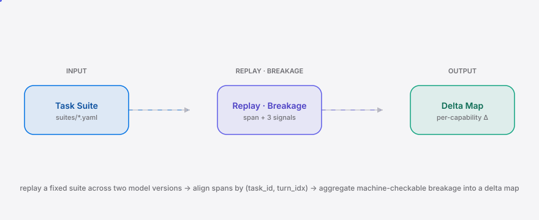

<div align="right"><sub><b>简体中文</b>&nbsp;&nbsp;⇄&nbsp;&nbsp;<a href="./README.en.md">English</a></sub></div>

<picture>
  <source media="(prefers-color-scheme: dark)" srcset="./assets/hero-dark.svg">
  <source media="(prefers-color-scheme: light)" srcset="./assets/hero-light.svg">
  
</picture>

<p align="center"><sub>把「Opus 5 变差了」变成「工具调用 −14%、拒答率 +28%」的模型版本回归归因 CLI。</sub></p>

<p align="center">
  <a href="./LICENSE"></a>
  &nbsp;<a href="https://github.com/SuperMarioYL/regatlas/releases"></a>
  &nbsp;<a href="https://github.com/SuperMarioYL/regatlas/actions/workflows/test.yml"></a>
  &nbsp;
</p>

<p align="center"><b>regatlas 回放固定任务套件，按 span 语义对齐轨迹，用可机检断裂信号产出每能力维度的回归图谱——让版本换班的隐性回归可证明、可归因。</b></p>

---

## 目录

- [架构](#架构)
- [为什么需要](#为什么需要)
- [安装](#安装)
- [快速开始](#快速开始)
- [用法](#用法)
- [演示](#演示)
- [配置](#配置)
- [付费](#付费)
- [路线图](#路线图)
- [许可证](#许可证)

<h2> 架构</h2>

<picture>
  <source media="(prefers-color-scheme: dark)" srcset="./assets/atlas-dark.svg">
  <source media="(prefers-color-scheme: light)" srcset="./assets/atlas-light.svg">
  
</picture>

单进程 CLI，无守护进程、无微服务。一个二进制等价物（`uv tool install`），三个子命令：`replay` 回放任务套件并产出带断裂信号的轨迹；`diff` 按 `(task_id, turn_idx)` 对齐两份轨迹、产出签名差值；`report` 聚合为每能力维度的 delta map。

<h2> 为什么需要</h2>

当一个 agent 把模型版本从 Opus-4 换到 Opus-5、从 GLM-4.5 换到 4.6 时，行为会以 API 契约从不声明的方式悄悄漂移——某个工具调用开始失败、拒答率爬升、某步规划塌掉。「Opus 5 怎么感觉变差了」这条讨论能冲上 HN 首页，说明这种感知是普遍且尖锐的，但版本换班审查今天只能靠人肉翻 trace 然后「感觉更差，先上了」。

regatlas 把这个动作变成可归因的：回放一份固定任务套件，用三个**可机检**断裂信号（`tool_call_success` 是否匹配预期工具、`refusal_detected` 是否命中中英文拒答词表、`schema_violation` 参数是否合法 JSON 且满足声明 schema）产出每能力维度的 delta。没有这个原语，回归只是感知；有了它，delta map 就是可证明、可贴进 PR 的回归证据。

> 与现有方案的区别：eval 平台（LangSmith / Langfuse / Helicone）的轨迹数据模型按单次部署内的 trace/span 建模，不是按跨版本回放对齐建模；契约 diff 工具只看 API 表面、不看行为，同一 schema 下变差的工具调用对它们是不可见的。regatlas 的护城河是「回放 + 可机检断裂层」——这是观察平台要加而不是重做的东西。

<h2> 安装</h2>

```bash
# 需要 Python 3.12+
uv tool install regatlas        # 或: pip install regatlas
```

仓库内置了 `suites/toolcalling.yaml` 与 `suites/refusal.yaml`，并附带离线录制响应（`tests/fixtures/*.responses.json`），所以从 `git clone` 到首次可见结果不需要任何 API key。

<h2> 快速开始</h2>

```bash
git clone https://github.com/SuperMarioYL/regatlas && cd regatlas
pip install -e .
regatlas run --suite suites/toolcalling.yaml --models opus-4,opus-5 --recordings tests/fixtures \
  && regatlas diff --baseline opus-4 --candidate opus-5 --out diff.json \
  && regatlas report --diff diff.json
```

<details>
<summary>sample output（report 输出片段）</summary>

```
## regatlas delta map

**opus-4 → opus-5** · suite `tool-calling` · 6 tasks across 1 capability.

| Capability | tool-call Δ | refusal Δ | schema Δ | n |
|---|---|---|---|---|
| tool-calling | ✗ -33% | · 0% | ✗ +17% | 6 |
```

`✗` 表示回归方向（工具调用成功率下降、拒答 / schema 违例上升），`✓` 表示改善，`·` 表示持平，`—` 表示该信号在本任务不适用。
</details>

<h2> 用法</h2>

**列出已配置的模型端点**

```bash
regatlas --list-models
```

**回放一个模型版本**（命中真实端点，输出 JSONL 到 stdout）

```bash
export REGATLAS_OPUS4_BASE_URL=https://api.openai.com/v1
export REGATLAS_OPUS4_API_KEY=sk-...
regatlas replay --suite suites/toolcalling.yaml --model opus-4 > traj_opus-4.jsonl
```

**离线回放**（用录制响应，无需 key；适合 CI 与本地演示）

```bash
regatlas replay --suite suites/toolcalling.yaml --model opus-5 \
  --recording tests/fixtures/opus-5.responses.json --out traj_opus-5.jsonl
```

**对齐并产出签名差值**

```bash
regatlas diff --from traj_opus-4.jsonl --to traj_opus-5.jsonl --out diff.json
# 也可以用别名标志与裸模型别名（自动解析为 traj_<alias>.jsonl）：
regatlas diff --baseline opus-4 --candidate opus-5 --out diff.json
```

**聚合为每能力维度 delta map**

```bash
regatlas report --diff diff.json           # 输出 markdown 表格 + 原始 DeltaMap JSON
regatlas report --diff diff.json --out atlas.md
```

完整脚本见 [`examples/quickstart.sh`](./examples/quickstart.sh)。

<h2> 演示</h2>


上面这版 GIF 由 [`docs/demo.tape`](./docs/demo.tape) 经 vhs 渲染；`.github/workflows/demo.yml` 可按需重新渲染。

<h2> 配置</h2>

模型端点从环境变量解析，`<NAME>` 由别名去掉非字母数字后大写得到（`opus-4` → `OPUS4`，`glm-4.6` → `GLM46`）：

| 变量 | 类型 | 默认 | 说明 |
|---|---|---|---|
| `REGATLAS_<NAME>_BASE_URL` | str | 无 | OpenAI 兼容端点 base URL（会拼上 `/v1/chat/completions`） |
| `REGATLAS_<NAME>_API_KEY` | str | 无 | 请求头 `Authorization: Bearer <key>` |
| `REGATLAS_<NAME>_MODEL` | str | 别名 | 请求体里 `model` 字段的 served 模型名 |

`replay` 还接受 `--recording PATH`（单份录制响应 JSON）用于离线运行；`run` 接受 `--recordings DIR`（目录下按 `<alias>.responses.json` 命名）批量离线回放。内置别名：`opus-4`、`opus-5`、`glm-4.5`、`glm-4.6`、`deepseek-v3`、`deepseek-v3.5`、`qwen-2.5`、`qwen-3`。

<h2> 付费</h2>

regatlas 的商业化路径面向**模型版本回归的发布门禁团队**——尤其是 GLM / Qwen / DeepSeek 这些短迭代周期的国产模型实验室，以及每次模型 drop 都要发布门禁的 agent 团队。

- **自托管 CLI（v0.1，MIT 开源）**：本地跑回放、产出可移植的 `DeltaMap` JSON，复制粘贴进 PR 评论即可证明某次版本换班的回归。自托管永久免费。
- **托管调度层（v0.2，付费）**：跨每个 nightly drop 自动定时回放、托管 delta 存储、团队工作区、发布门禁 webhook（「当 `refusal_detected_delta` > +15% 时 PagerDuty 告警」）。
  - 团队版：**¥2,000 / 月 / 团队**（≤5 席 + 50 次调度回放 / 月），超量 **¥8 / 次**。
  - 海外 agent 团队 USD 镜像：**$29 / 席 / 月**。
  - 按次计费是因为模型 drop 是脉冲式的、不是匀速的。

最小「愿意付钱」路径：某国产实验室的发布门禁工程师用 OSS CLI 在内部模型换班上跑出 delta map，证明「4.5→4.6 拒答 +28%」，转发给 lead 后问 regatlas「能不能每晚定时跑并在拒答飙升时告警」——这个问题就是 v0.2 托管层的购买触发点。

<h2> 路线图</h2>

- [x] **m1 — 任务套件回放**：`replay` 跨 OpenAI 兼容端点回放固定套件，产出带 `Span` + `Breakage` 的 JSONL 轨迹。
- [x] **m2 — 对齐 + 断裂信号**：`diff` 按 `(task_id, turn_idx)` 对齐两份轨迹，产出每信号签名差值 `SpanDiff`。
- [x] **m3 — delta 报告**：`report` 按能力维度聚合成 delta map，渲染 markdown 表格 + 原始 JSON。
- [ ] **v0.2 — 托管调度层**：跨 nightly drop 定时回放、delta 存储、团队工作区、发布门禁 webhook。
- [ ] **v0.2 — 导出适配器**：`regatlas export --format langsmith` / `langfuse`，让 delta map 落进现有轨迹存储。
- [ ] **v0.2+ — 原生厂商 Messages / Gemini API 归一化**（v0.1 仅覆盖 OpenAI 兼容端点）。
- [ ] **未来 — 多轮轨迹对齐、不可测回归的判断面板**（judgment panel 覆盖可机检信号的尾部）。

<h2> 许可证</h2>

MIT，见 [LICENSE](./LICENSE)。欢迎在 [Issues](https://github.com/SuperMarioYL/regatlas/issues) 提交回归案例或 PR。

<p align="center"><sub><a href="./LICENSE">MIT</a> © 2026 SuperMarioYL</sub></p>
