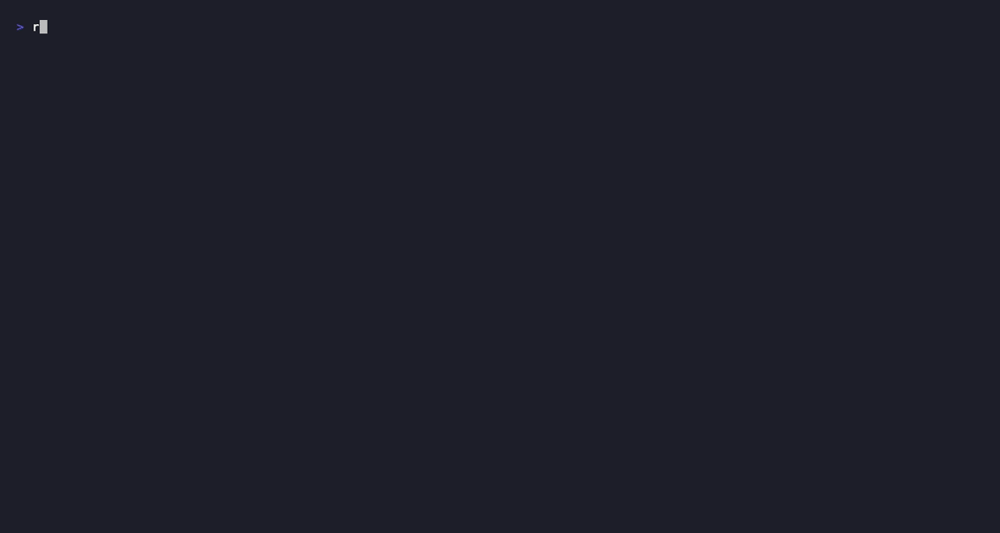

[English](README.en.md) | **简体中文**

<picture>
  <source media="(max-width: 640px) and (prefers-color-scheme: dark)" srcset="assets/presentation/hero-mobile-dark.svg">
  <source media="(max-width: 640px)" srcset="assets/presentation/hero-mobile-light.svg">
  <source media="(prefers-color-scheme: dark)" srcset="assets/presentation/hero-dark.svg">
  
</picture>

**回放固定套件，对齐两组轨迹，按能力汇总工具调用匹配、拒答词命中和参数检查的变化。**

`v0.1.0` · `Python 3.12+` · [MIT](LICENSE)

[Website](https://regatlas.lei6393.com) · [Demo record](docs/demo-results.json)

## 为什么使用

更换模型之后，单看总体回答很难指出哪类任务发生变化。regatlas 将任务预期写入套件，对每条响应计算明确的布尔信号，再按任务 ID 与轮次对齐，保留从汇总差值回到具体响应的路径。

## 架构

<picture>
  <source media="(max-width: 640px) and (prefers-color-scheme: dark)" srcset="assets/presentation/architecture-mobile-dark.svg">
  <source media="(max-width: 640px)" srcset="assets/presentation/architecture-mobile-light.svg">
  <source media="(prefers-color-scheme: dark)" srcset="assets/presentation/architecture-dark.svg">
  
</picture>

suite 读取 YAML，replay 从服务或 RecordingClient 得到响应，breakage 计算信号并产出 Span。align 按 `(task_id, turn_idx)` 配对，delta 按 capability 聚合 candidate − baseline，report 输出 Markdown 与 JSON。这里的 signed delta 是带正负号的数值差，不是密码学签名。

源码入口：[src/regatlas/cli.py](src/regatlas/cli.py) · [src/regatlas/replay.py](src/regatlas/replay.py) · [src/regatlas/suite.py](src/regatlas/suite.py) · [src/regatlas/breakage.py](src/regatlas/breakage.py) · [src/regatlas/align.py](src/regatlas/align.py) · [src/regatlas/delta.py](src/regatlas/delta.py) · [suites/toolcalling.yaml](suites/toolcalling.yaml)

## 安装

需要 Python 3.12+ 与 uv。自带响应 fixture 可离线运行；真实回放需自行配置服务与密钥。

```bash
git clone https://github.com/SuperMarioYL/regatlas.git
cd regatlas
uv venv --python 3.12
uv pip install --python .venv/bin/python -e .
```

## 快速开始

从自带两份响应 fixture 回放六个任务。文件名中的模型标签仅是历史 fixture 名称，无法视为真实模型测量。百分号显示的是比例之差，应读作百分点变化。

```bash
.venv/bin/python examples/presentation-demo.py
```

完整输入与执行步骤见上方命令及 [Demo 记录](docs/demo-results.json)。

## 使用

```bash
.venv/bin/regatlas run --suite suites/toolcalling.yaml --models opus-4,opus-5 --recordings tests/fixtures
.venv/bin/regatlas diff --from traj_opus-4.jsonl --to traj_opus-5.jsonl --out diff.json
.venv/bin/regatlas report --diff diff.json --out atlas.md
```
这些命令仍使用 fixture。真实 `replay --suite ... --model NAME` 在没有 --recording 时调用服务。`run --out-dir` 控制轨迹目录；`diff --baseline/--candidate` 是来源/目标别名。

## 实际 Demo

<picture>
  <source media="(max-width: 640px) and (prefers-color-scheme: dark)" srcset="assets/presentation/process-mobile-dark.svg">
  <source media="(max-width: 640px)" srcset="assets/presentation/process-mobile-light.svg">
  <source media="(prefers-color-scheme: dark)" srcset="assets/presentation/process-dark.svg">
  
</picture>

### 生成差值图谱

得到六项任务的工具匹配与参数检查差值；未执行响应中命名的工具。

```text
$ .venv/bin/python examples/presentation-demo.py
## regatlas delta map

**baseline-fixture → candidate-fixture** · suite `toolcalling` · 6 tasks across 1 capability.

| Capability | tool-call Δ | refusal Δ | schema Δ | n |
|---|---|---|---|---|
| tool-calling | ✗ -33% | · 0% | ✗ +17% | 6 |

<!-- raw DeltaMap JSON — the portable regression artifact -->
```json
{
  "tool-calling": {
    "tool_call_success_delta": -0.3333333333333333,
    "refusal_detected_delta": 0.0,
    "schema_violation_delta": 0.16666666666666666,
    "n_tasks": 6
  }
}
```
```

## 能力与接入

<picture>
  <source media="(max-width: 640px) and (prefers-color-scheme: dark)" srcset="assets/presentation/integrations-mobile-dark.svg">
  <source media="(max-width: 640px)" srcset="assets/presentation/integrations-mobile-light.svg">
  <source media="(prefers-color-scheme: dark)" srcset="assets/presentation/integrations-dark.svg">
  
</picture>

内置 toolcalling 与 refusal 两套任务。工具成功信号检查是否输出预期工具名，不执行那个工具；schema 检查 JSON 与 required 字段，不是完整 JSON Schema 验证。拒答由中英文词表检测。


## 配置

端点变量为 `REGATLAS_<NAME>_BASE_URL`、`_API_KEY`、`_MODEL`，别名去掉非字母数字再大写。套件指定 capability、expected_tool_call 与 expected_schema.required。`--recording` 选单文件，`--recordings` 选按别名命名的目录。

## 路线图与范围

当前提供单轮套件、轨迹对齐和能力报告。托管调度、更多导出适配器、多轮分析和更丰富的验证语义仍是后续方向。

- 规则信号不等于整体质量或安全性；拒答增加是否为回归取决于任务预期。
- 本示例没有真实模型调用，不能用于给任何模型排名或声称其版本退化。

 · [Recording script](docs/demo.tape)

## 许可证

[MIT](LICENSE)
